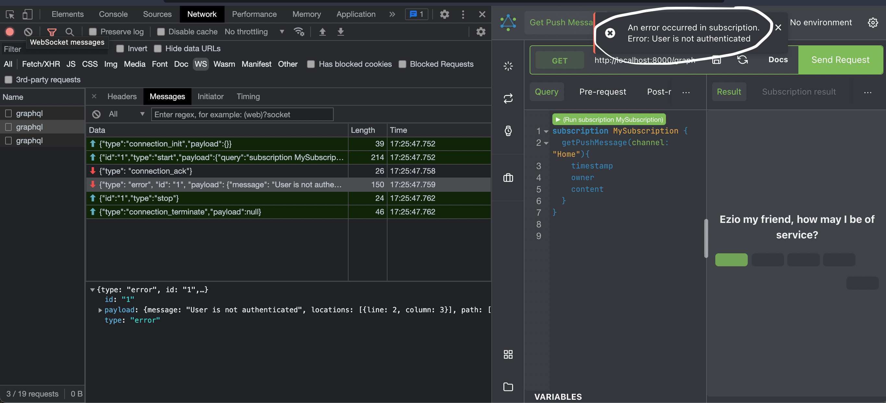
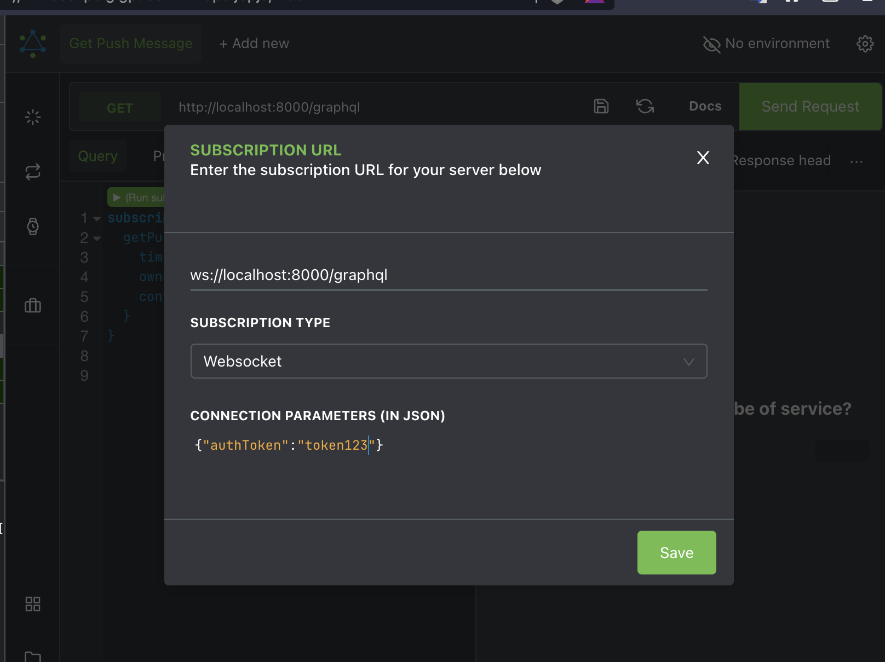
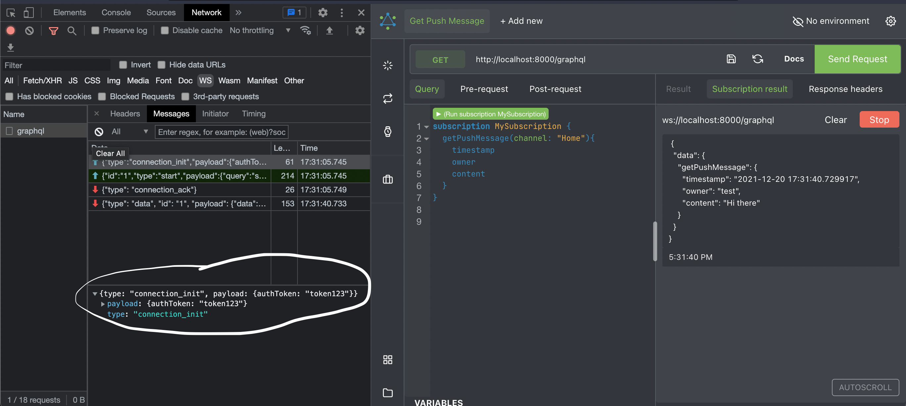

# strawberry-websocket-auth
a fastapi server for testing authentication during websocket connection with [strawberry-graphql 🍓🍓](https://strawberry.rocks/)

### Testing on Altair Graphql Client

- ### without authentication payload

- ### adding authentication payload in connection params

- ### with authentication payload

